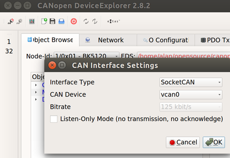
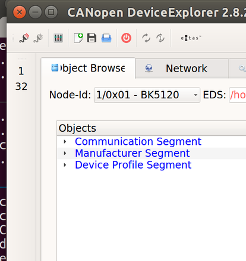
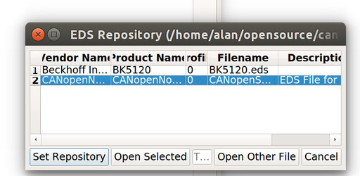
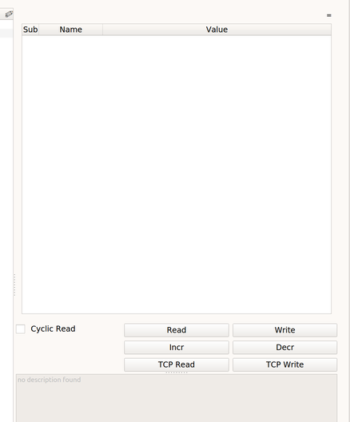
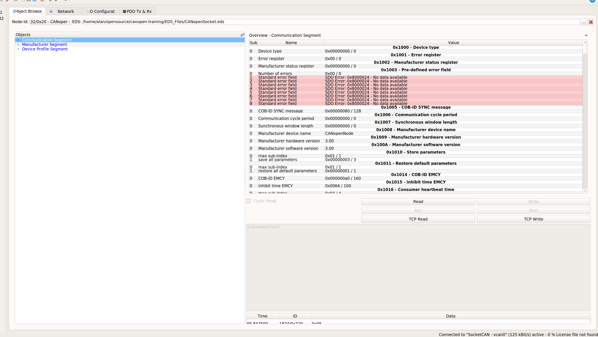

CANOpen Training
-----------------------------------

### READ THIS FIRST

Before taking the class, make sure you download this entire repository ahead of class.

    $ cd /home/$USER
    $ git clone git@github.com:alan707/canopen-training.git
    
This material is completely open source so feel free to modify/improve and make a pull request to merge any changes.


### Excercise 1

1. Install can-utils
```sh
    $ sudo apt-get update
    $ sudo apt-get install can-utils
```
2. Form teams of 2 people each (Blue and Red)

3. Connect wiring as follows:


4. Once USB cable is connected, run the following:

```sh
    $ sudo slcand -o -c -s6 /dev/ttyACM* can0
    $ sudo ifconfig can0 up
    $ sudo ifconfig txqueuelen 1000 
```

Make sure `can0` is up and running:
    
    $ ifconfig can0
    

## Red Team

Using `cangen` from `can-utils` transmit the following:
- send CAN message with `CAN ID: 0x7E0`
- Data Length: 3 bytes
- Data payload: `00 FF 00`
- Gap (ms): 100

## Blue Team

- Using `candump` from `can-utils` confirm you received `CAN ID: 0x7E0`
- using `cangen` from `can-utils`, flood the CAN bus with random messages at 10ms


### Excercise 2

### Clone CANOpenSocket Repo

Clone the project from git repository and get submodules:

    $ git clone https://github.com/CANopenNode/CANopenSocket.git
    $ cd CANopenSocket
    $ git submodule init
    $ git submodule update


### Download CANOpen GUI Application

Unzip the CANOpen GUI [EMTAS CDE GUI Application](zipped_archives/linux-emtas-cde-2_8_2.zip) and save at the root of this directory.

### Blue and Red Teams: Test CAN dump

Set up a virtual CAN device:

    $ sudo modprobe vcan
    $ sudo ip link add dev vcan0 type vcan
    $ sudo ip link set up vcan0
    
You should see it in ifconfig.  Run:

    $ ifconfig

If you haven't yet, install `can-utils`

    $ sudo apt-get install can-utils

### Blue and Red Teams: Compile CANOpenSocket applications

Compile canopencomm

    $ cd CANopenSocket/canopencomm
    $ make

Check it works with:

    $ ./canopencomm --help
    
Compile canopend

    $ cd CANopenSocket/canopend
    $ make

Check it works with:

    $ app/canopend --help


### Blue Teams: Set up Node 32 device

From terminal, compile and start *canopend*.

    $ echo - > od4_storage
    $ echo - > od4_storage_auto
    $ app/canopend vcan0 -i 32 -s od4_storage -a od4_storage_auto

In a separete terminal, now run: 

    candump vcan0
    
And you should see an output similar to this:

    vcan0  720   [1]  00                        # Bootup message.
    vcan0  084   [8]  00 50 01 2F F3 FF FF FF   # Emergency message.
    vcan0  720   [1]  7F                        # Heartbeat messages
    vcan0  720   [1]  7F                        # one per second.


Now there is operational state (0x05) and there shows one PDO on CAN
address 0x184. To learn more about PDOs, how to configure communication
and mapping parameters and how to use them see other sources of CANopen
documentation (For example article of PDO re-mapping procedure in [CAN
newsletter magazine, June 2016](http://can-newsletter.org/engineering/engineering-miscellaneous/160601_can-newsletter-magazine-june-2016) ).

### Red Teams: Set up Node 2 device

Start *canopend* (master on nodeID=2) in the same

    $ app/canopend vcan0 -i 2 -c "/home/$USER/canopensocket"


    $ ./canopencomm --help

#### SDO master

Play with it and also observe CAN dump terminal. First Heartbeat at
index 0x1017, subindex 0, 16-bit integer, on nodeID 32.

    $ ./canopencomm [1] 32 read 0x1017 0 i16 -s "/home/$USER/canopensocket"
    $ ./canopencomm [1] 32 write 0x1017 0 i16 5000 -s "/home/$USER/canopensocket"

In CAN dump you can see some SDO communication. You will notice, that
Heartbeats from node 32 are coming in 5 second interval now. You can do
the same also for node 2. Now store Object dictionary, so it will preserve
variables on next start of the program.

    $ ./canopencomm 32 w 0x1010 1 u32 0x65766173 -s "/home/$USER/canopensocket"

You can read more about Object dictionary variables for this
CANopenNode in [canopend/CANopenSocket.html].


#### NMT master
If node is operational (started), it can exchange all objects, including
PDO, SDO, etc. In pre-operational, PDOs are disabled, SDOs works. In stopped
only NMT messages are accepted.

    $ ./canopencomm 32 preop -s "/home/$USER/canopensocket"
    $ ./canopencomm 32 start -s "/home/$USER/canopensocket"
    $ ./canopencomm 32 stop -s "/home/$USER/canopensocket"
    $ ./canopencomm 32 r 0x1017 0 i16 -s "/home/$USER/canopensocket"		# time out
    $ ./canopencomm 32 reset communication -s "/home/$USER/canopensocket"
    $ ./canopencomm 32 reset node -s "/home/$USER/canopensocket"
    $ ./canopencomm 2 reset node -s "/home/$USER/canopensocket"

In *canopend terminal* you see, that both devices finished. You will need to manually start up `Node 32` and `Node 2`

### Excercise 3

We will build on top of the existing CAN bus.

1. Open up EMTAS GUI application by running:
```sh
    $ ./canopen-training/linux-emtas-cde-2_8_2/cde.sh
```

2. Check settings to make sure you are running on `vcan0` at `125 kbps`



3. Find the "Connect to CAN" icon:



4. Load Repository with EDS files located at `canopen-training/EDS_Files`



5. Under Object Browse, click on Read button

 

6. You should see a screen like this:




